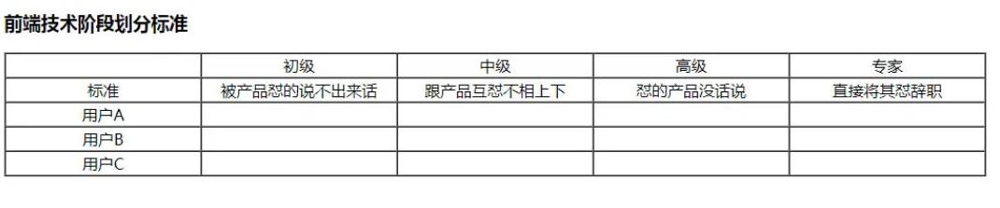
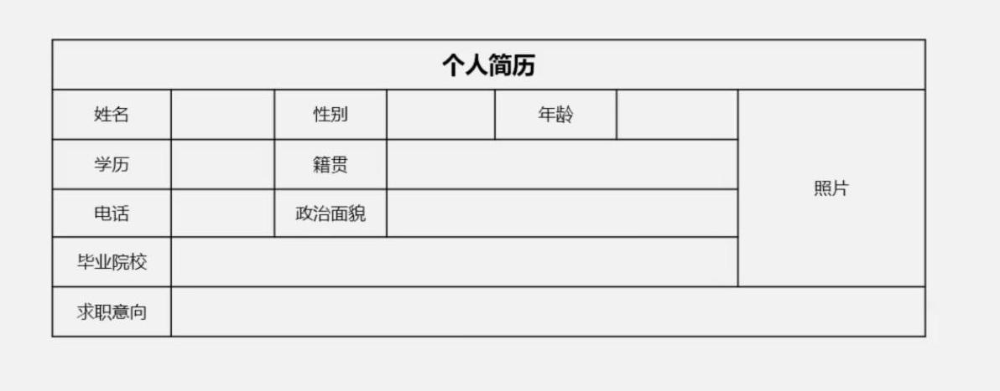

# Today's task: Making a Table
***
## 1. Targets:
1. Learn to use table tag;
2. Learn to use tr tag;
3. Learn to use td tag;  
4. Learn to use border;  
5. Learn to use cellspacing;  
6. Learn to use col;  
7. Learn to use width in col element;  
8. Learn to use align in tr element;  
9. Learn to use colspan and rolspan to make a merged table;  
10. Learn to use thead, tbody, tfoot tags;  
11. Learn to use colgroup to shorter codes;  
12. Learn to use remarks;
***  
## 2. Requirements:  
The first table must look like this:  
  
The second talbe must look like this:

***
## 3. Learning Link:  
[Bilibili-WebDeveloper](https://www.bilibili.com/video/BV1Bb411v7w8?p=10)
***  
## 4. Date: 2021/05/21