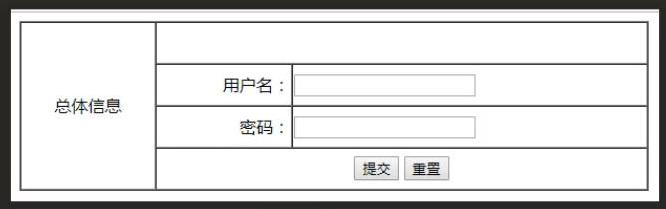

# Today's task: Making A Form  
***  
## 1. Targets:  
1. Learn to use form tag;  
2. Learn to use input;  
3. Learn to use text;  
4. Learn to use password;  
5. Learn to use radio;  
6. Learn to use checkbox;  
***  
## 2. Requirements:  
The form must look like this:  

***  
## 3. Learning Link:
[Bilibili-Webdeveloper-Lesson013](https://www.bilibili.com/video/BV1Bb411v7w8?p=13&spm_id_from=pageDriver)
***  
## 4. Date: 2021/05/22