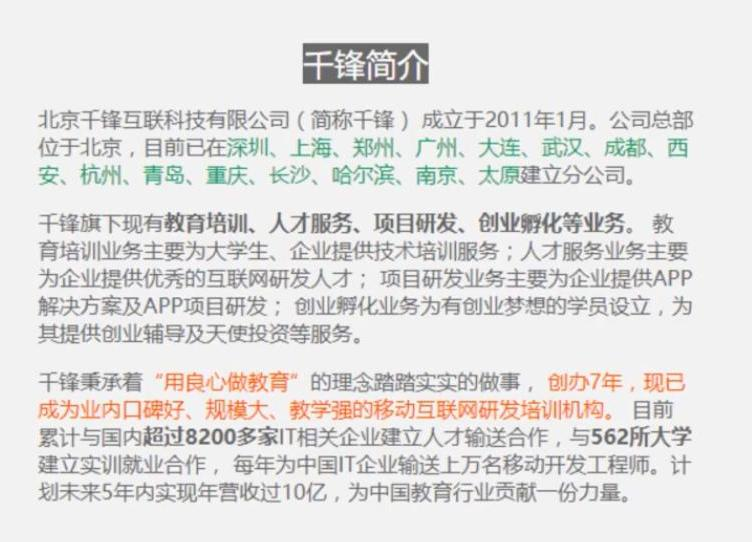

# Today's task: Elements for Container  
***  
## 1. Targets:  
Learn to use some css elements in HTML file.  
Including:  
> 1. Learn to use p tag;  
> 2. Learn to use span tag;  
> 3. Learn to use background;  
> 4. Learn to use color;  
> 5. Learn to use div tag;  
> 6. Learn to use style;  
> 7. Learn to use text-align;  
> 8. Learn to use margin;  
> 9. Learn to use b tag;  
> 10. Learn to use font-size;
***  
## 2. Requirements:  
Final document must look like this:  
  
***  
## 3. Learning Link:  
[Bilibili-Webdeveloper-Lesson016](https://www.bilibili.com/video/BV1Bb411v7w8?p=16&spm_id_from=pageDriver)  
***  
## 4. Date: 2021/05/23