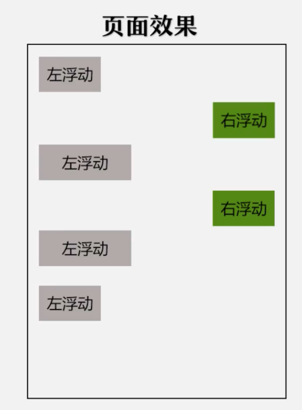

# This lesson's task: Float  
***  
## 1. Targets:  
> 1. Learn to use float;  
> 2. Learn to use padding;  
> 3. Learn to use margin;  
> 4. Learn to use width;  
> 5. Learn to use height;  
> 6. Learn to use border-width;  
> 7. Learn to use border-style;  
> 8. Learn to use font-size;  
> 9. Learn to sue list-style;  
> 10. Learn to use background-color;  
***  
## 2. Requirements:  
Final Effect:  
  
***  
## 3. Learning Link:  
[Bilibili-Webdeveloper-Lesson025](https://www.bilibili.com/video/BV1Bb411v7w8?p=25&spm_id_from=pageDriver)  
***  
## 4. Date: 2021/05/25