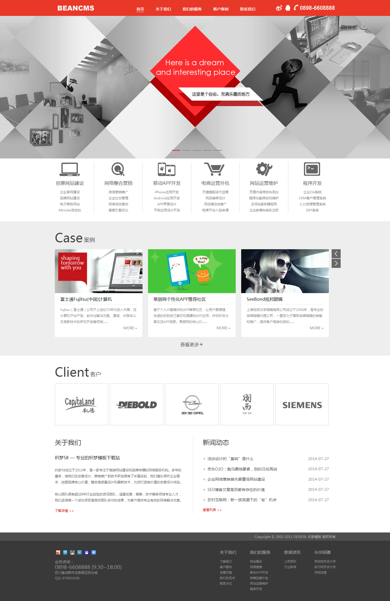

# Today's Task: Page Layout  
***  
## 1. Learning task:  
From today's lesson, I need learn to use:  
> 1. margin;  
> 2. padding;  
> 3. width;  
> 4. height;  
> 5. background-color;  
> 6. color;  
> 7. text-decoration;  
> 8. float;  
> 9. boarder-style;  
> 10. boarder-color;  
> 11. border-width;  
> 12. padding-left;  
> 13. padding-right;  
> 14. overflow;  
> 15. line-height;  
> 16. text-align;  
> 17. font-size;  
***  
## 2. Requirements:  
Final Effect:  
  
***  
## 3. Learning Link:
[Bilibili-Webdeveloper-Lesson029](https://www.bilibili.com/video/BV1Bb411v7w8?p=29&spm_id_from=pageDriver)  
***  
## 4. Learning Date: 2021/05/27