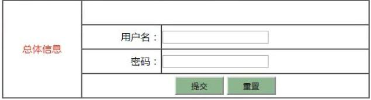

# Today's task: Css Basic  
***  
## 1. Targets:  
Learn to use some css elements in HTML file;  
Including:  
> 1. Learn to use style;  
> 2. Learn to use color;  
> 3. Learn to use width;  
> 4. Learn to use height;  
> 5. Learn to use background-color;  
***  
## 2. Requirements:  
Final Form must look like this:  
  
***  
## 3. Learning Link:  
[Bilibili-Webdeveloper-Lesson015](https://www.bilibili.com/video/BV1Bb411v7w8?p=15&spm_id_from=pageDriver)  
***  
## 4. Date: 2021/05/22

